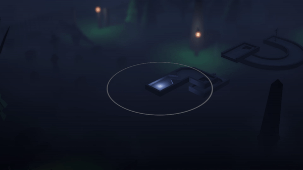

# SereniTee
## What is SereniTee?
SereniTee is a relaxing, low poly take on procedurally generated mini golf across ever-expanding vibrant, spiritful backdrops. 

SereniTee is an entirely solo project I've worked on over the past few months and I'm happy to finally have something presentable and almost in a fully-releasable state.

## How To Play
Simply head on over to https://github.com/DKLynch/SereniTee/releases/latest and download the newest release .zip. Extract the folder to your desired place and then run SereniTee.exe

NOTE: I recommend running on Medium/High graphics settings at the moment until further optimization has been implemented further down the line.

## Controls
* Q/E - Rotate Camera
* Z/X - Zoom Camera
* V - Camera Hole Flythrough
* LMB/RMB - Hold left click to start shot, let go to take the shot. Right clicking cancels the shot in progress.
* Space - Hop (One hop can be used per stroke while the ball is in motion, and costs an extra stroke)
* F - Reset To Previous Shot Position
* R - Reset To Hole Start
* K - Move to Next Hole (This is currently only in for debug/testing purposes, don't go cheating now :eyes:)
* L - Toggle Ball Light
* T - Toggle Hole Transparency (Used for seeing the ball when it is otherwise obstructed by the hole itself)

## Regarding Open Source
I've finally gotten around to prepping the project for open source, I've gotten rid of the paid asset that was in use from the repo (wasn't too keen on the legal ramifications of redistributing someone else's work) and I think I'm now safe to go public. Granted there's a lot of irrelevant stuff to sift through in the repo when it's outwith Unity, but if you wish to take a look at any of my scripts they can be found in the [Scripts](/Assets/Scripts) folder.

Note: If anyone has a problem with anything I have hosted here, please get in touch with me and I'll try and rectify it as swiftly as possible.

## Other Screenies/Gifs

## Special Thanks
This project does make use of a few 3D models by [Quaternius](https://twitter.com/quaternius) and [Kenney](https://twitter.com/kenneynl), so major props to them.

I also make use of Bunny83's mesh welding solution posted at: https://answers.unity.com/questions/1382854/welding-vertices-at-runtime.html
